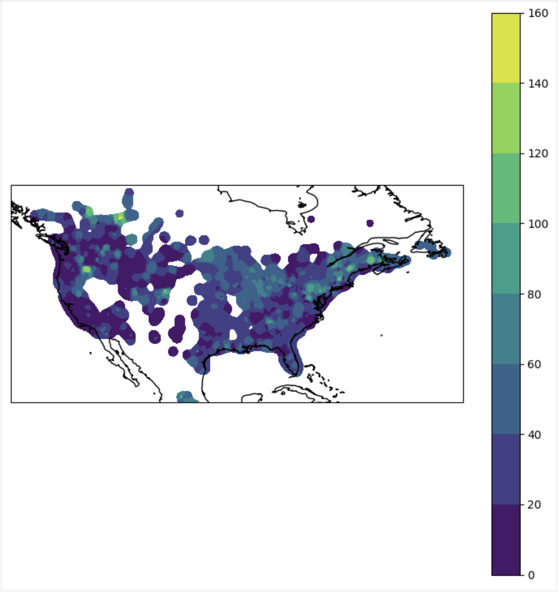

## Air Quality Data

### AQI is sourced from: https://files.airnowtech.org/?prefix=airnow/
* Provides Daily Air Quality measurements that is GEOSPATIAL back to 2012 (11 year record)
* Most files come in .grib2, so we use pygrib to read the files
* These are gridded files, so we need to convert to vector
* We can aggregate the daily records, sum the AQI indicators
* We can summarize the statistics: frequency, days between events
* Below shows the .grib2 file in *matplotlib*

